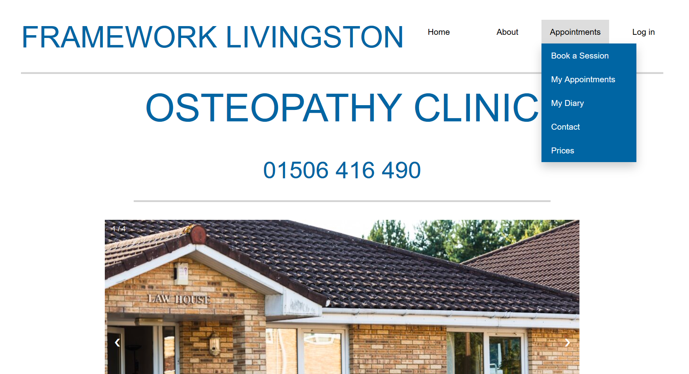
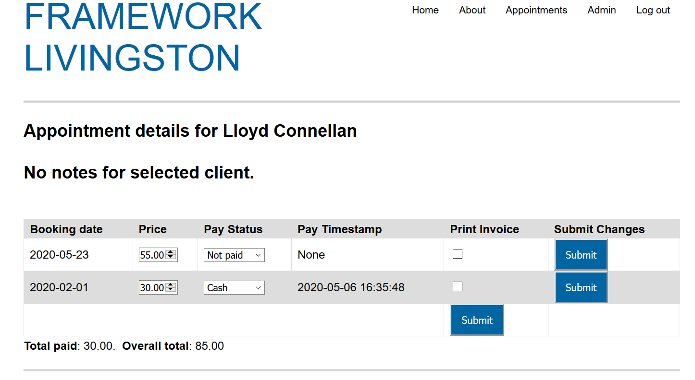
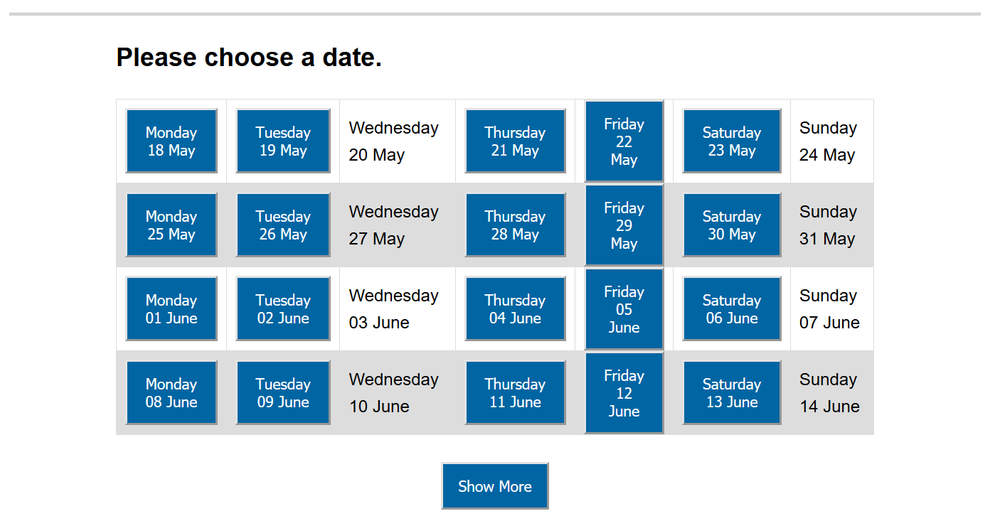

Website for a booking system for an osteopathy clinic. Written in Python using Flask.

Run using ./run.py

## Features

* Clients and practitioners can book appointments that are recorded in the database (SQL)
* Account registration using email verification
* Notes can be attached to appointments with annotated images and text
* Diary for easy access
* Summary of booking information that can be searched through and modified
* Summary of client info & payments
* Way to select periods of time to block off where no appointments can happen
* Dynamically create new accounts during booking that can be linked to emails later

